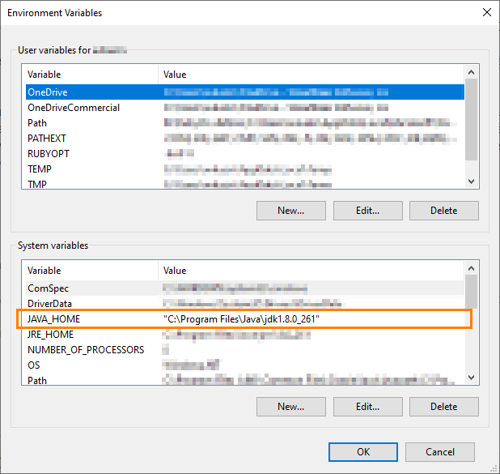
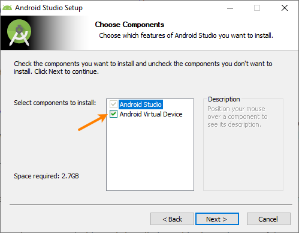
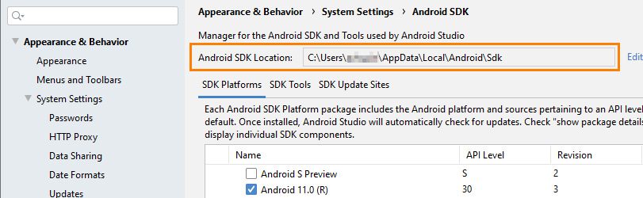
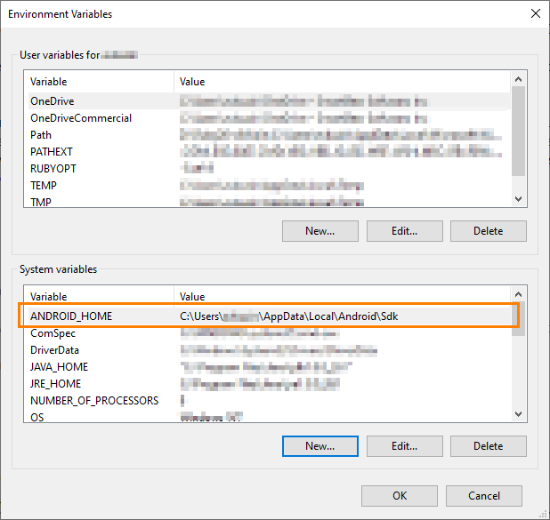
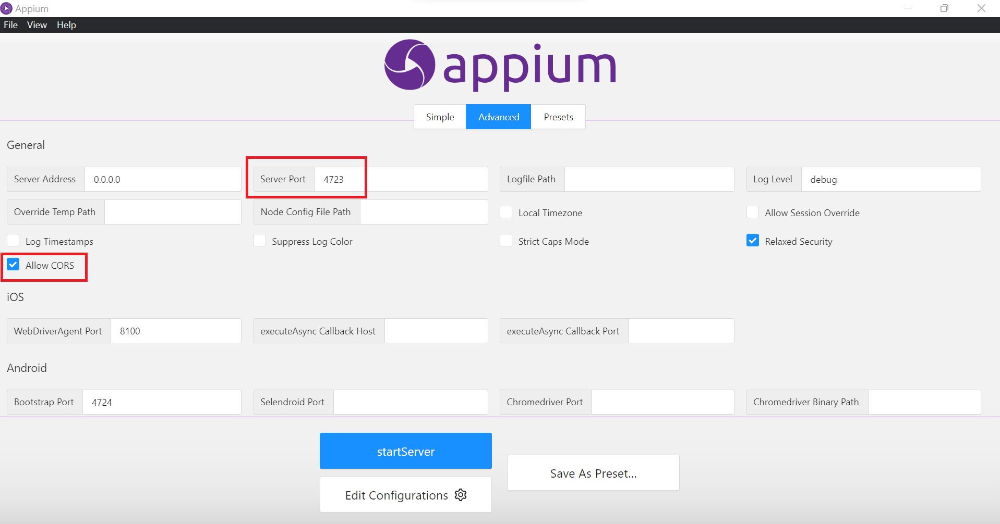
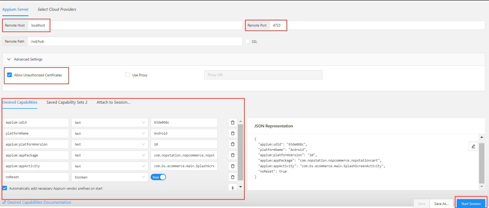

# Main Tool to Automate 
Here I have used appium as a main tool to automate the test
android app.
Appium is an open-source, cross-platform test automation tool for native, hybrid, mobile web and desktop apps. Appium supports simulators (iOS), emulators (Android), and real devices (iOS, Android, Windows, Mac).

# Why Appium?
You usually don't have to recompile your app or modify it in any way, due to the use of standard automation APIs on all platforms.
You can write tests with your favorite dev tools using any WebDriver-compatible language such as Java, JavaScript, Python, Ruby, C# with the Selenium WebDriver API. There are also various third party client implementations for other languages.
You can use any testing framework.
Some drivers, like xcuitest and uiautomator2 ones have built-in mobile web and hybrid app support. Within the same script, you can switch seamlessly between native app automation and webview automation, all using the WebDriver model that's already the standard for web automation.
You can run your automated tests locally and in a cloud. There are multiple cloud providers that support various Appium drivers (mostly targeting iOS and Android mobile automation).
Appium Inspector allows visual debugging of automated tests and could be extremely useful for beginners.
Investing in the WebDriver protocol means you are betting on a single, free, and open protocol for testing that has become a web standard. Don't lock yourself into a proprietary stack.

For example, if you use Apple's XCUITest library without Appium you can only write tests using Obj-C/Swift, and you can only run tests through Xcode. Similarly, with Google's UiAutomator or Espresso, you can only write tests in Java/Kotlin. Appium opens up the possibility of true cross-platform native app automation, for mobile and beyond. Finally!
If you're new to Appium or want a more comprehensive description of what this is all about, please read our Introduction to Appium Concepts.

# Set up Appium on Windows for Testing Android Devices
Applies to TestComplete 15.42, last modified on August 01, 2022
The instructions below describe how to set up an Appium instance on a Windows machine and to configure it to manage Android devices.

### 1. Install JDK
1. Download the installation package from this website:

https://www.oracle.com/java/technologies/javase-downloads.html

Run the installer and follow the instructions you will see on the screen.

2. Specify the path to your JDK version in the JAVA_HOME environment variable. To do this, open the Control Panel, search for “environment variables”, in the subsequent dialog, click Environment Variables, and then set the variable value:

The JAVA_HOME environment variable
### 2. Install NodeJS and NPM
   Download the installation packages from this website:

https://nodejs.org/en/download/

Run the installer and follow the instructions you will see on the screen.

### 3. Install Appium
   Start the Command Prompt as an administrator.

Run the following command:

npm install -g appium

After the installation is over, run Appium to ensure it works. To do this, run this command in the Command Prompt (it should be run in the administrator mode):

appium

### 4. Install AndroidStudio
   Download the installation package from the following website:

https://developer.android.com/studio/

Run the installer and follow the instructions you will see on the screen.

When installing, make sure to select the Android Virtual Device component:

The Android Virtual Device option
### 5. Configure Android virtual devices
   Start AndroidStudio.

In the Welcome dialog, select Configure > SDK Manager.

In the subsequent SDK Manager dialog box:

On the SDK Platforms tab, select the SDKs that you will need for testing.

	Select at least one SDK.
Switch to the SDK Tools tab and make sure the following tools are selected there:

Android SDK Build-tools
Note:	Select the latest available version.
Android SDK Platform-Tools
Intel x86 Emulator Accelerator (HAXM installer)
Copy the value of the Android SDK Location box at the top of the SDK Manager dialog. We will need this value later:

Close the SDK Manager.

3. Now, in the Welcome dialog, select Configure > AVD Manager. This will open the AVD Manager dialog where you can create and launch Android virtual devices (emulators).
If the dialog doesn’t list the device you need, click Create Virtual Device and create the needed device emulator.

4. To create and run tests, you need to specify the path to Android SDK files (the one that the “Android SDK Location” text box displayed) in the ANDROID_HOME environment variable: open the Control Panel, search for “environment variables”, in the subsequent dialog, click Environment Variables, and then set the variable value. If the variable doesn’t exist, add it to the “System variables” list:

After Appium is set up and configured and has mobile devices managed, you can connect to it from your TestComplete computer to create and run tests.

# Create a new or open an existing Java(gradle) project
[Please visit this link to know about how to open a new Java(gradle) project using IntelliJ IDEA](https://www.jetbrains.com/help/idea/getting-started-with-gradle.html#create_project)

# Appium Inspector to Identify Elements
1.	Appium Inspector download & install
2.	Configure Appium Desktop client & Appium Inspector
#### Appium Desktop
- Go to Advanced option of Appium Server and set the following values:
- Server address: localhost (or 0.0.0.0)
- Port: 4723
- Allow CORP: yes

### Appium Inspector
Now, Open Appium Inspector and follow the following steps
- Set Remote host: localhost
- Set Port: 4723
- Set Path: /wd/hub
- Allow Unauthorized Certificates
- Set your mobile app capabilities  
- Start Appium Server GUI
- Appium Inspector will open and you will be all inspect the mobile elements

# Run the test Apk to your android mobile device
Please download and install the
[apk](https://github.com/srrozario/srrozario-nopStationCartAppAutomation/tree/main/src/test/resources) to you android mobile device
and connect the android device via adb

# Run Test Cases
To run the test cases, go to the desired package where all the test cases (java classes) are written and right click on
the desired java class and click on Run

# Test Scenarios
Here two test scenarios are covered, the scenarios are:
#### Scenario: 01 Customer add products in his shopping cart

- Given: Customer on home page after opening nopCart mobile app
- When: Customer clicks "electronics" from our categories list from home page
- And: Customer clicks to "Nokia Lumia 1020" product details page
- Then: Customer selects size "Large" from product details page
- And: Customer clicks plus button to increase Qty by "2"
- Then: Customer clicks add to cart button to add the product in his cart as a guest user

#### Scenario: 02 Customer successfully place order as a guest user
- Given: Customer go to shopping cart by clicking top cart icon
- When: Customer clicks checkout button from shopping cart page
- And: Customer selects checkout as guest from shopping cart page
- Then: Customer inputs all the details in checkout billing details page and click continue
- And: Customer selects "Next Day Air" as shipping method and click continue
- And: Customer selects "Check/Money Order" as payment method and click continue
- And: Customer clicks next button on payment information page
- Then: Customer clicks confirm button to place the order
- And: Customer successfully place order as a guest user

# Helpful Resources
- [appium.io](https://appium.io/docs/en/about-appium/api/)
- [selenium.dev](https://www.selenium.dev/documentation/webdriver/)
- [appium inspector web version](https://inspector.appiumpro.com/)